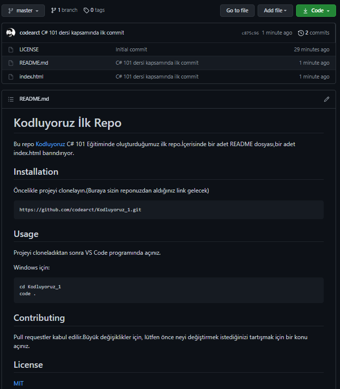

# Kodluyoruz İlk Repo

Bu repo [Kodluyoruz](https://www.kodluyoruz.org/) C# 101 Eğitiminde oluşturduğumuz ilk repo.İçerisinde bir adet README dosyası,bir adet index.html barındırıyor.



## Installation

Öncelikle projeyi clonelayın.(Buraya sizin reponuzdan aldığınız link gelecek)

```
https://github.com/codearct/Kodluyoruz_1.git
```

## Usage

Projeyi cloneladıktan sonra VS Code programında açınız.

Windows için:

```
cd Kodluyoruz_1
code .
```

## Contributing

Pull requestler kabul edilir.Büyük değişiklikler için, lütfen önce neyi değiştirmek istediğinizi tartışmak için bir konu açınız.

## License

[MIT](https://mit-license.org/)
